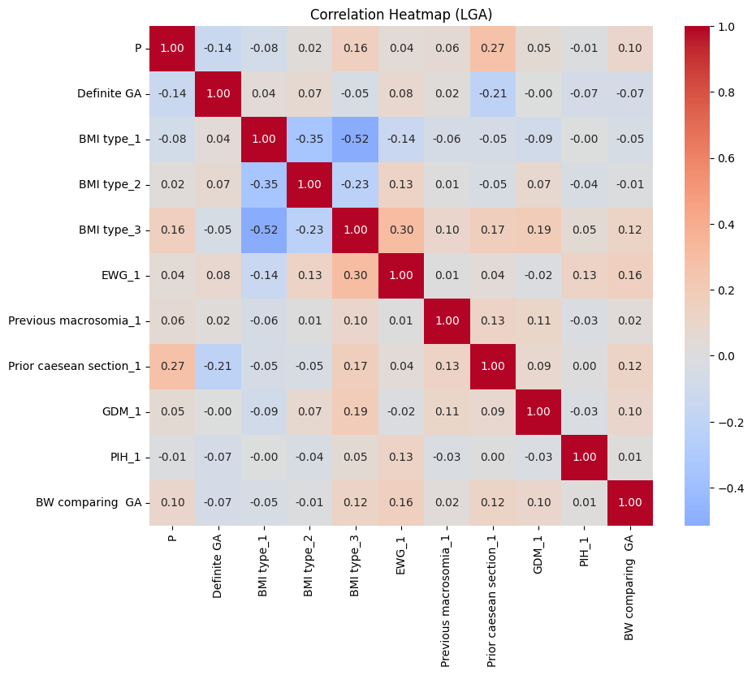
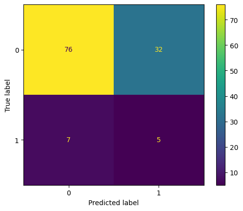

# Predicting Pregnancy Outcomes Using Machine Learning

## Overview

This project explores the use of machine learning models to analyze pregnancy outcomes associated with excessive gestational weight gain (EWG) using retrospective clinical data.

The dataset contains 532 retrospective clinical samples related to pregnancy outcomes and excessive gestational weight gain according to Asian BMI classification.

The objective of this project is not to develop a production-level medical AI system, but to explore how basic machine learning methods can be applied to real-world clinical datasets for predictive analysis and outcome interpretation.

Due to privacy and ethical considerations involving retrospective clinical data, the original dataset is not publicly distributed in this repository.

---

## Objectives

* Explore relationships between maternal clinical variables and pregnancy outcomes
* Apply supervised machine learning models to retrospective clinical data
* Compare model behavior and feature importance
* Practice data preprocessing, model evaluation, and interpretation using Python

---

## Technologies Used

* Python
* pandas
* scikit-learn
* matplotlib
* seaborn
* Jupyter Notebook

---

## Machine Learning Models

The following models were explored:

* Logistic Regression
* Random Forest Classifier

---

## Clinical Features

Examples of input variables:

* BMI classification
* Excessive gestational weight gain (EWG)
* Previous macrosomia
* Prior caesarean section
* Gestational age
* Gestational diabetes mellitus (GDM)
* Pregnancy-induced hypertension (PIH)

Examples of predicted outcomes:

* Fetal macrosomia
* NICU admission
* Caesarean section
* Dystocia
* Postpartum hemorrhage (PPH)

---

## Workflow

1. Data preprocessing and missing value handling
2. Feature encoding and scaling
3. Exploratory data analysis
4. Correlation heatmap visualization
5. Model training and evaluation
6. Feature importance interpretation

---

## Results

Binary classification of large for gestational age (LGA) outcomes improved model performance compared to the original multi-class classification approach.

The Logistic Regression model achieved:
- Test ROC-AUC: 0.615
- Test Accuracy: 0.68

Exploratory analysis suggested excessive gestational weight gain (EWG) demonstrated positive association with both LGA and pregnancy-induced hypertension (PIH) outcomes.

Model interpretation was additionally compared against clinical reasoning to identify limitations related to class imbalance and rare-event frequencies.

---

## Example Outputs

### Correlation Heatmap (LGA Analysis)

### Confusion Matrix (Binary LGA Classification)

---

## Evaluation Metrics

Evaluation metrics include:

* Accuracy
* Precision
* Recall
* F1-score
* ROC-AUC
* Confusion Matrix

---

## Key Learning Points

* Handling clinical datasets with limited sample sizes
* Understanding class imbalance in medical prediction problems
* Comparing interpretable and ensemble-based models
* Evaluating model outputs against clinical reasoning

---

## Limitations

* Small retrospective dataset (n=532)
* Single-center data source
* Exploratory educational project
* Models are not intended for clinical deployment or medical decision-making

---

## Future Improvements

* Additional feature engineering
* More advanced imbalance handling techniques
* Hyperparameter optimization
* External dataset validation
* Exploration of additional ML models

---

## Author

Pholasith Laoruengrong
Robotics Engineering Student (THWS)
Board-Certified OB/GYN Specialist
